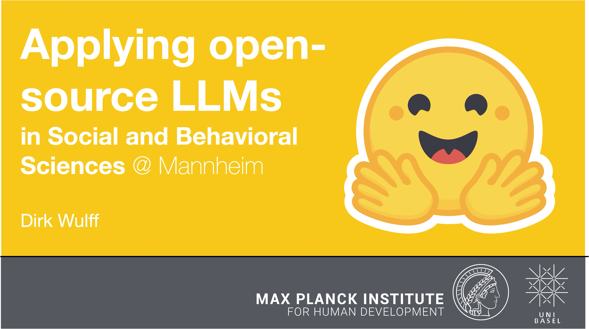

## LLM4BeSci at Uni Mannehim, Mar 2026



The course introduces the use of open-source large language models (LLMs) from the Hugging Face ecosystem for research in the behavioral and social sciences. 

Held by [Dirk Wulff](https://www.mpib-berlin.mpg.de/person/93374/2549)<br>
Materials by [Zak Hussain](https://zak-hussain.github.io/), [Taisiia Tikhomirova](https://www.mpib-berlin.mpg.de/person/131137/2549), [Valentin Kriegmair](https://www.mpib-berlin.mpg.de/person/valentin-kriegmair/63440), and [Dirk Wulff](https://www.mpib-berlin.mpg.de/person/93374/2549)

### Schedule

#### Day 1
<font style="font-size:10">
09:30 PM - 10:00 AM: Welcome & Intro<br>
10:00 PM - 11:00 PM: [Talk: Intro to LLMs](day_1/day_1a.pdf)<br>
11:00 PM - 11:15 PM: Break<br>
11:15 PM - 11:45 PM: [Talk: A gentle intro to Hugging Face and Python](day_1/day_1b.pdf)<br>
11:45 PM - 12:00 PM: Lecture setup<br>
12:00 PM - 01:30 PM: Lecture<br>
01:30 PM - 02:30 PM: Lunch<br>
02:30 PM - 03:00 PM: Setup Colab <br>
03:45 PM - 04:30 PM: [Exercise: Running pipelines](day_1/day_1.ipynb)<br>
04:30 PM - 05:00 PM: Walkthrough<br>

#### Day 2
09:30 AM - 10:00 AM: Recap quiz<br>
10:00 AM - 11:00 AM: [Talk: Intro to transformers & embeddings](day_2/day_2_embeddings.pdf)<br>
10:45 AM - 11:00 AM: Break<br>
11:00 AM - 12:00 PM: [Talk: Intro to transformers & embeddings (continued)](day_2/day_2_embeddings.pdf)<br>
12:00 PM - 01:00 PM: Discussion: Find applications in small groups<br>
01:00 PM - 02:30 PM: Lunch<br>
02:30 PM - 03:30 PM: [Exercise: Clarifying personality psychology](day_2/day_2_embeddings.ipynb)<br>
03:30 PM - 03:45 PM: Break<br>
03:45 PM - 04:45 PM: [Intro to classification and regression](day_2/day_2_classification.pdf)<br>
04:45 PM - 05:30 PM: [Exercise: Classifying media bias]() (combination of 2 classification a and b)<br>

### Resources
<ul>
<li><a href="https://doi.org/10.3758/s13428-024-02455-8">Hussain, Binz, Mata, & Wulff (2024). A tutorial on open-source large language models for behavioral science. *Behavior Research Methods*.</a></li>
<li><a href="https://doi.org/10.31219/osf.io/ybvzs">Wulff, Hussain, & Mata (2025). The Behavioral and Social Sciences Need Open LLMs. *OSF*.</a></li>
<li><a href="https://doi.org/10.1038/s41562-024-02089-y">Wulff & Mata (2025). Semantic embeddings reveal and address taxonomic incommensurability in psychological measurement. *Nature Human Behavior*.</a></li>
<li><a href="https://doi.org/10.1177/096372142513820">Wulff & Mata (2025). Escaping the Jingle-Jangle Jungle: Increasing Conceptual Clarity in Psychology Using Large Language Models. *Current Directions in Psychological Science*.</a></li>
<li><a href="https://huggingface.co/docs">Hugging face documentation</a></li>
<li><a href="https://transformersbook.com/">Hugging face book</a></li>
<li><a href="https://www.youtube.com/watch?v=wjZofJX0v4M&list=PLZHQObOWTQDNU6R1_67000Dx_ZCJB-3pi&index=5">But what is a GPT (3Blue1Brown)</a></li>
</ul>

### Before the course

#### Hugging Face and Meta Llama License
1. Make sure you have a Hugging Face account (https://huggingface.co/join).
2. Go to the [`meta-llama/Llama-3.2-3B-Instruct` model page](https://huggingface.co/meta-llama/Llama-3.2-3B-Instruct) and fill in the 'COMMUNITY LICENSE AGREEMENT' form at the top of the page to get access to the model (this may take a day or so). 

#### Google Colab and GitHub Repository
3. If you do not have a Google account, you will need to create one (this can be deleted after the workshop).

### During the course
1. Navigate to Google Drive (https://drive.google.com/).
2. In the top-left, click New > More > Colaboratory. If you do not see Colaboratory, you may need to click "Connect more apps", 
search for 'Colaboratory,' and install it. Then click New > More > Colaboratory.
3. Copy the following code snippet into the first cell of the notebook. Run it (```shift + enter``` or click &#9658; button) to mount your Google Drive to the Colab environment.
A pop-up will ask you to connect; click through the steps to connect your Google Drive to Colab (unfortunately, this only works if you give Google full permissions).
```
from google.colab import drive
drive.mount("/content/drive")
```
4. Create a second cell in your notebook using the "+ Code" button that appears when you hover your cursor right under the first cell. Copy and run the following code snippet in the second cell of your notebook to clone the GitHub repository to your Google Drive:
```
%cd /content/drive/MyDrive
!git clone https://github.com/dwulff/LLM4BeSci_2025MetaRep
```
5. Go back to your Google Drive and navigate to the folder "dwulff/LLM4BeSci_2025MetaRep" (this is your own copy, so you can edit it how you like, and the changes won't affect anyone else's copies). You should see the directories `day_1`, `day_2`, `day_3` containing the relevant notebooks (.ipynb files) and data (it may take a couple of minutes for the files to appear) for each day's exercises.

You have now successfully set up your Google Colab environment and cloned the GitHub repository! 

You are now ready to work through all the exercises in the course!  
